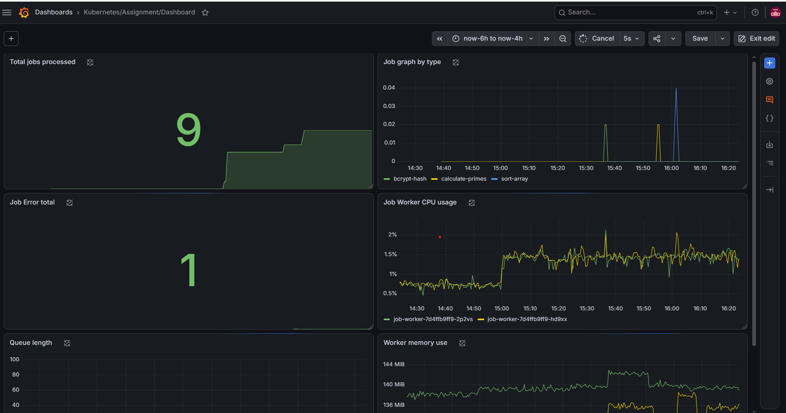
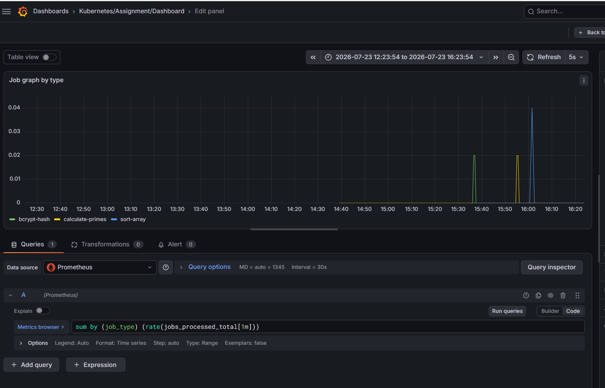
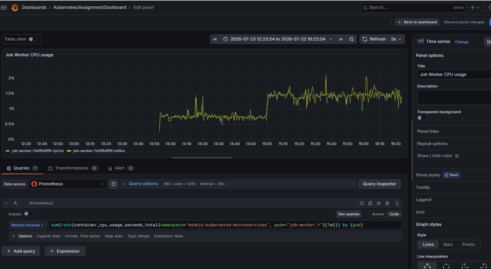
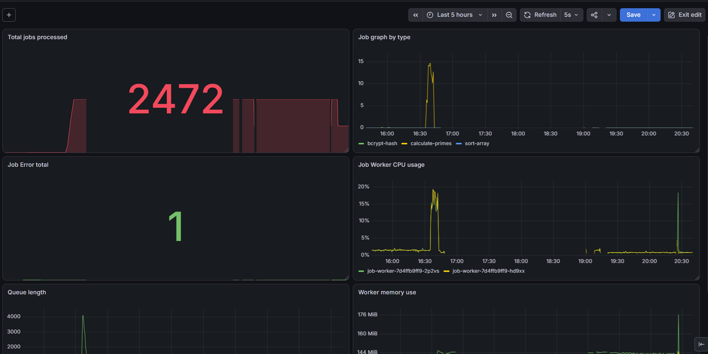
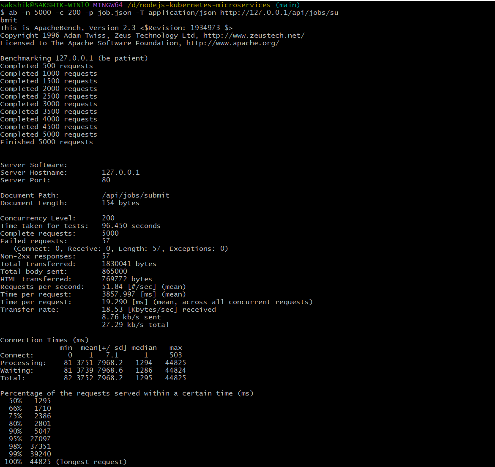

# Job Processing System

A Kubernetes based Node.js microservices architecture, build with queue-based job processing, autoscaling, and Prometheus plus Grafana monitoring.

## Overview

This assignment shows a scalable job processing system where users submit cpu heavy jobs through API, which then are processed by worker pods that scale automatically based on load.

**Key Features**

- Job submission ans status check via REST APIs
- Redis-based queue for reliable job processing
- CPU-intensive worker (primes, bcrypt, array sorting)
- Horizontal Pod Autoscaling (HPA) on CPU usage
- Prometheus metrics + Grafana dashboards
- Docker + Kubernetes ready

## Project Structure

```bash
.
├── apps/
│   ├── api-gateway/      # job submitter
│   ├── job-worker/       # scalable worker
│   └── stats-service/    # stats aggregator
├── packages/
│   └── shared/           # common types, shared files
├── infra/
│   ├── docker-compose.yml
│   └── env/              # env files
├── k8s/                  # kubernetes manifests
│   ├── base/
│   ├── deployments/
│   ├── services/
│   └── hpa/
└── README.md
```

## Tech Stack

- Backend: Node.js, TypeScript, Express
- Queue: Redis
- Container: Docker
- Deployment: Kubernetes
- Monitoring: Prometheus and Grafana
- Testing: Vitest

## Folder Details

### infra/ - project infrastructure config to run platform

```
docker-compose.yml
env-example/ - having prod env cofigs for each service
k8s/ - kubernetes manifests(deployments, services, HPA etc)
```

### packages/shared/

- Reusable - Redis client, types, job store, queue helpers and shared dependencies stored.

### apps/

-It includes all services workflow

#### api-gateway(Job submitter)

    - exposes REST endpoints for job submission and status checking.
    - Pushes jobs into Redis queue and returns job ID immediately.
    - Main endpoints:

- `POST /api/jobs/submit`
- `GET /api/jobs/status/:id`

#### job-worker(Scalable worker)

    - Consumes jobs from redis queue
    - Performs CPU intensive operations:
    - calculate primes up to 100000
    - bcrypt hashing
    - generate and sort array of 100000 integers
    - Updates job status and results back to Redis.
    - Exposes Prometheus metrics (`/metrics`), available at endpoint-(`GET /api/worker/metrics`)
    - This is horizontally scaled using HPA.

#### stats-service (Stats aggregator)

    - Provides overall system statistics
    - Main endpoint: `GET /api/stats`
    - Also exposes Prometheus metrics(`/metrics`), available at endpoint-(`GET /api/metrics`)

## Quick start Locally

### start everything with docker

```bash
cd infra
docker compose up --build
```

### Submit a job

```bash
curl -X POST http://localhost:3000/api/jobs/submit \
  -H "Content-Type: application/json" \
  -d '{"type": "calculate-primes"}'
```

### Status check

```bash
curl http://localhost:3000/api/jobs/status/<job-id>
```

## Deployment

- Start cluster

```
minikube start --driver=docker
minikube addons enable ingress
kubectl cluster-info
```

- build images inside minikube's docker daemon
- apply all manifests

```
kubectl apply -f k8s/
```

### Monitoring

#### Prometheus + Grafana (Helm)

- Add repo

```
helm repo add prometheus-community https://prometheus-community.github.io/helm-charts
helm repo update
```

- Install

```
helm install prometheus prometheus-community/kube-prometheus-stack \
  --namespace monitoring \
  --create-namespace
```

- Monitoring manifest can be appplied only after this, so to watch and wait for it to run-

```
kubectl get pods -n monitoring --watch
```

- Monitoring stack manifest apply-

```
kubectl apply -f infra/k8s/monitoring/service-monitor.yaml
```

- Access
  Prometheus-
  kubectl port-forward svc/prometheus-prometheus 9090:9090 -n monitoring

Grafana-

```
kubectl port-forward -n monitoring svc/monitoring-grafana 3003:80
```

Default login creds - admin/generated-secret-password

### Monitoring Dashboards

#### Grafana overview



#### Job Processing Metrics



#### CPU Usage



#### Load monitoring



#### Stress Testing



## Assignment Features Implemented

- job submitter, status check APIs
- scalable worker with CPU tasks
- redis queue integration
- Kubernetes + HPA
- Prometheus metrics
- Monitoring setup, Grafana visualization
